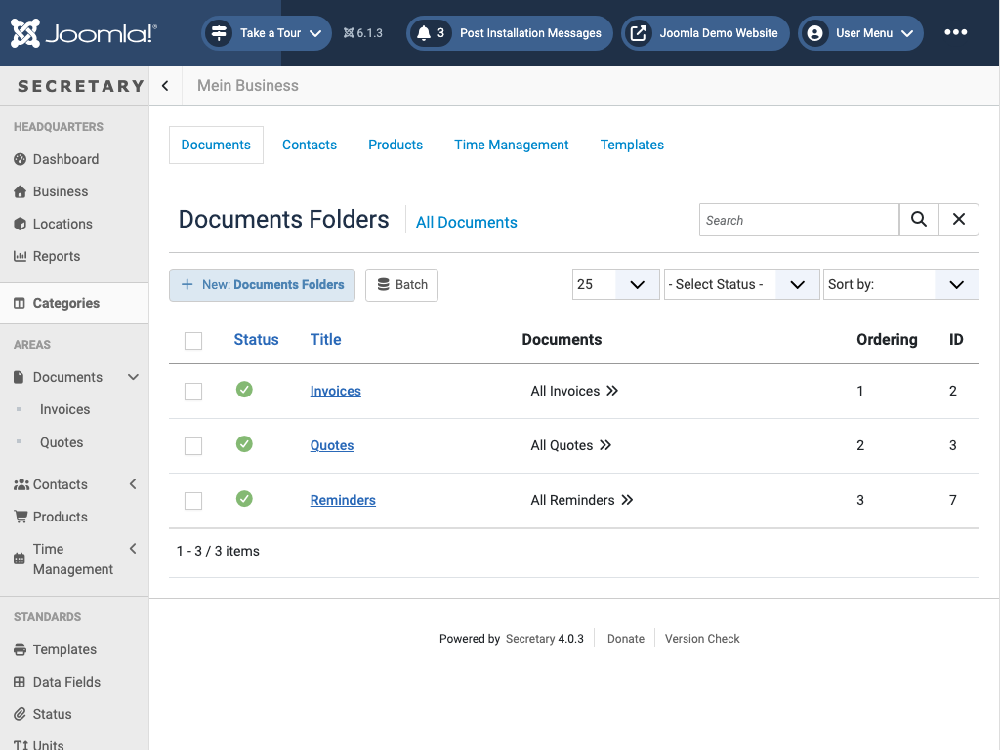

# Categories (Folders)

`view=folders&extension=<documents|subjects|products|...>` - manage the folders/categories that Documents, Contacts, Products, Time Management, and Templates are organized into. Each extension has its own independent folder tree, reachable via the *Categories* link on that section's list page, or the tabs at the top of this view.

Each row is one folder: its title (linked to edit it), a quick link to *All \<Folder\>* (e.g. "All Invoices" - jumps straight to that filtered list), its ordering position, and its ID. *New: \<Folder\> Folders* creates another one; *Batch* bulk-edits selected folders. A folder is what gives a Documents entry its type (Invoice vs. Quote vs. Reminder) or a Contact/Product its group - see [Concepts](concepts.md).

← [Back to overview](index.md)
