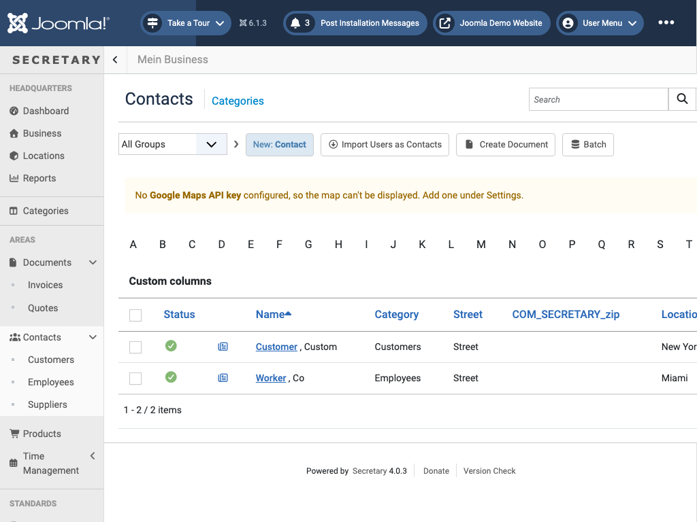
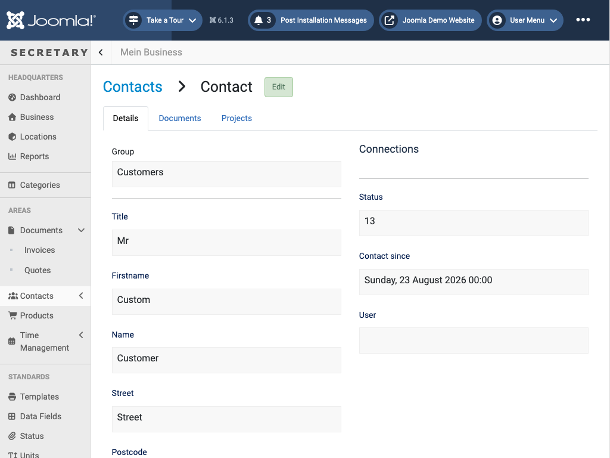

# Contacts

`view=subjects&catid=<group id>` - customers, employees, and suppliers, grouped into Customer/Employee/Supplier categories by default (also managed under [Categories](categories.md)).

**List toolbar**:
| Action | What it does |
|---|---|
| New: Contact | Creates a new contact |
| Import Users as Contacts | Creates contacts from existing Joomla user accounts (name, email, registration date only - re-running it after users change names can create duplicates) |
| Create Document | Bulk-creates a document (invoice/quote/etc.) for each selected contact |
| Batch / Delete / Check-In | Same as [Documents](documents.md) |

An A-Z bar filters the list by last-name initial. The list's columns are user-configurable via *Custom columns* (Category, Street, Zip, Location, Country, Phone, Email, Number, ID) - pick what's relevant and save; the same picker is what [Settings → Areas](settings.md#areas) configures by default.

## Editing a contact

The **Details** tab holds the contact's group, title, name, and address/contact fields. **Documents** lists every document tied to this contact; **Projects** does the same for time entries. A contact detail page can also show a map of its address - this needs a Google Maps API key configured under [Settings](settings.md#details), or the map is simply omitted (as in the screenshot above).

← [Back to overview](index.md)
