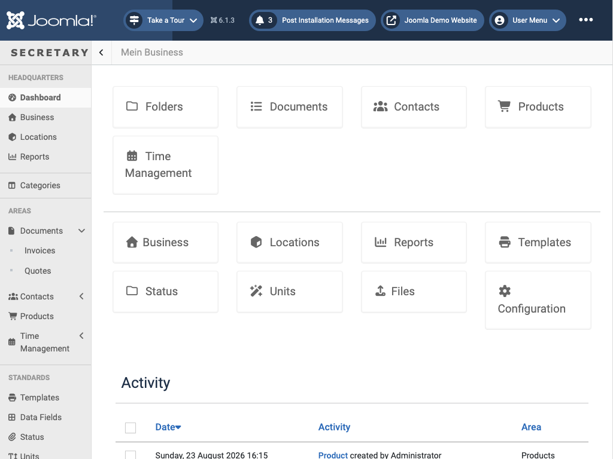

# Dashboard

`view=dashboard` - the landing page after login. Gives an overview across the active business before you drill into a specific section.

The top row is quick navigation to the areas you work in day to day (Folders, Documents, Contacts, Products, Time Management); the second row covers business-wide setup (Business, Locations, Reports, Templates, Status, Units, Files, Configuration).

**Activity** lists recent create/edit/delete events across the whole business - what changed, who changed it, and which area it belongs to (Documents, Contacts, Products, ...). It's the fastest way to see what happened since you last logged in, and doubles as an audit trail. Which event types get logged here is configurable under [Settings → Activity](settings.md#details).

← [Back to overview](index.md)
