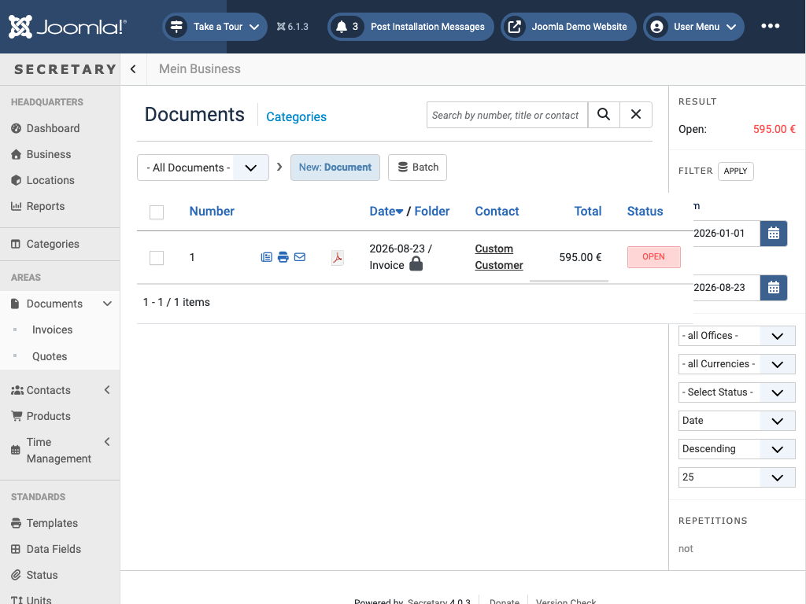
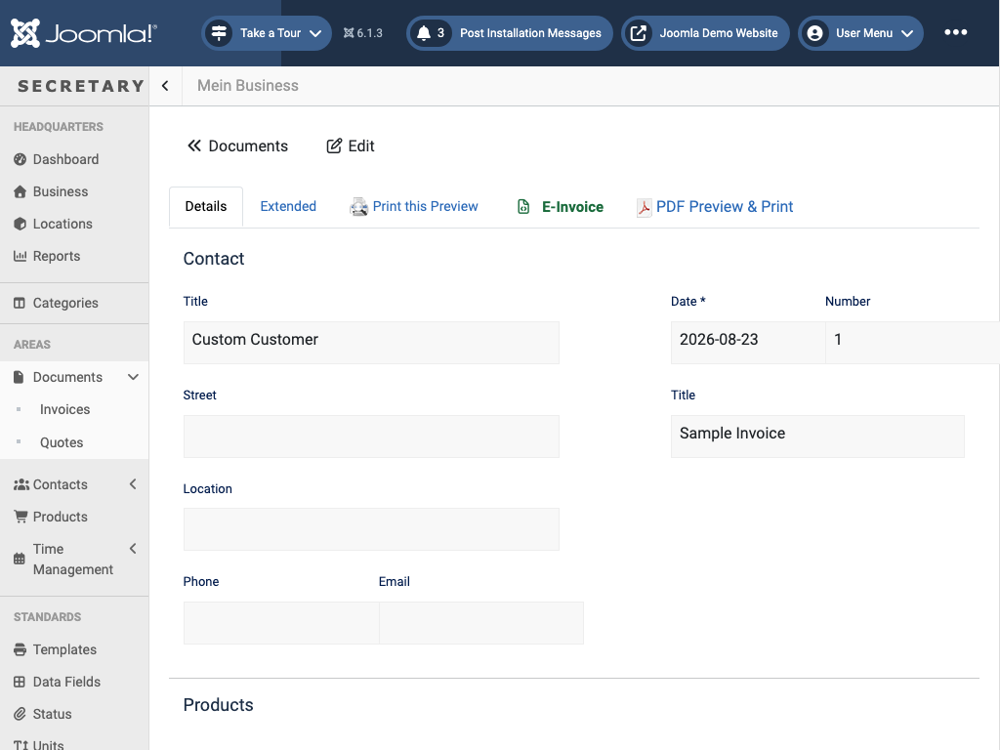

# Documents

`view=documents&catid=<folder id>` - invoicing and accounting. This is the most-used part of the component.

**Folders**: by default, Invoices, Quotes, and Reminders (a business can add more under [Categories](categories.md)). Switch between them with the folder dropdown at the top of the list, or view everything at once via *All Documents*.

**List toolbar**:
| Action | What it does |
|---|---|
| New: *\<Folder\>* | Creates a new document in the current folder (e.g. "New: Invoice") |
| Batch | Bulk-edit selected documents (e.g. move folder, change status) via a dialog |
| Update product data | Refreshes selected documents' line items from the current product prices/descriptions |
| Delete | Removes the selected documents |
| Check-In | Releases a document that's stuck "checked out" (e.g. after a crashed edit session) |

**List columns**: Number, per-row quick actions, Date / Folder, Contact, Total, Status.

**Per-row quick actions** (icons next to the document number):
- **Show** - opens the document detail view
- **Preview** - renders the document as PDF in an inline popup
- **Email** - opens a dialog to send the document (as PDF) to the contact
- **PDF Preview & Print** - direct PDF download (only shown once a PDF library is selected, see [PDF generation](pdf.md))

**Status**: each document has a toggleable state shown in the Status column (e.g. *Open* for an unpaid invoice); click it to mark as done/paid.

The sidebar panel on the right lets you filter the list by date range, office, currency, and status, and shows a running total (e.g. "Open: 595.00 €") for whatever's currently filtered. Search filters by document number, title, or contact name.

## Editing a document

The edit form is split into tabs:
- **Details** - contact info (name/address/phone/email, either typed directly or picked via the contact search next to the "Contact" heading), date/number/title, the line-item table, and the sidebar (template, email template, office/location, attachment upload, and payment info: status, deadline, paid amount).
- **Extended** - additional custom fields configured under [Data Fields](settings.md).
- **Permissions** - per-document Joomla ACL overrides, same mechanism as [Settings → Permissions](settings.md#permissions).

**Line items**: each row has quantity, unit, product number, title, a free-text description, unit price, tax rate, and the computed sum. *New row* adds a blank line; a line item typed directly here (not picked from an existing product) is automatically saved as a new [Product](products.md) record too, so it's reusable next time. *Edit tax rates* lets you adjust the tax percentages available per row; *Add Item Number* and *New row: Document* are additional row-entry helpers. Below the table: net amount, tax (inclusive/exclusive toggle), total, currency, and a "discount to total" shortcut.

**Above the tabs**, once the document has been saved at least once:
- **Print this Preview** - inline PDF preview popup (needs a [PDF library](pdf.md))
- **E-Invoice** - downloads an EN16931/XRechnung 3.0-compliant UBL invoice XML (Germany's e-invoicing standard). This needs no PDF library - it's built directly as XML - but does need the document to have a number, a contact, and at least one line item.
- **PDF Preview & Print** - full PDF download (needs a [PDF library](pdf.md))

← [Back to overview](index.md)
