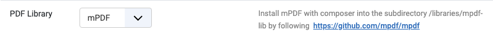

# PDF generation

Document Preview, Email, and PDF export (see [Documents](documents.md#editing-a-document)) all need a PDF rendering library. Neither ships bundled with the component - they're large and separately licensed - so you install one yourself and select it under **Settings → Details → PDF Library**:



Until a library is installed *and* selected, the Documents list shows a warning banner and PDF-dependent actions won't produce output. (The **E-Invoice** action is unaffected - it builds an XML file directly and needs no PDF library.)

Secretary supports two libraries. Pick one:

| | mPDF | Dompdf |
|---|---|---|
| Setting value | `mPDF` | `Dompdf` |
| Speed / footprint | Lighter, faster | Heavier, more accurate CSS |
| Recommended for | Most setups | Complex layouts/CSS |

Both are installed as **their own isolated Composer project** under `libraries/`, separate from Joomla core's own `vendor/` - so installing or updating one can never break the other, or Joomla itself.

## Option A: install with Composer (any existing install)

Run this on the server (or inside the container, if you're on Docker) from the Joomla root:

```bash
# mPDF
mkdir -p libraries/mpdf-lib
cd libraries/mpdf-lib
composer require mpdf/mpdf --no-interaction --optimize-autoloader
```

```bash
# Dompdf
mkdir -p libraries/dompdf-lib
cd libraries/dompdf-lib
composer require dompdf/dompdf --no-interaction --optimize-autoloader
```

That's it for either one - Composer resolves all of Dompdf's own dependencies (php-font-lib, php-svg-lib, ...) automatically, no separate downloads needed. Then go to **Settings → Details → PDF Library**, pick it, and Save.

> Dompdf also still supports the older, non-Composer install: download a release bundle that includes `autoload.inc.php` into `libraries/dompdf` (with `php-font-lib` under `libraries/dompdf/lib/php-font-lib` and `php-svg-lib` under `libraries/dompdf/lib/php-svg-lib`). Secretary checks for the Composer install first and falls back to this if present - useful if you already have it set up this way, but new installs should just use Composer above.

## Option B: bake it into the Docker image

If you're building your own image from this repo's [Dockerfile](../Dockerfile), add the same isolated `composer require` as a build step. The `joomla` stage already does exactly this for mPDF:

```dockerfile
ARG MPDF_VERSION=v8.2.4
USER schefa
RUN mkdir -p /var/www/html/libraries/mpdf-lib && \
    cd /var/www/html/libraries/mpdf-lib && \
    composer require mpdf/mpdf:${MPDF_VERSION} --no-interaction --optimize-autoloader
```

To add Dompdf the same way, append a similar block (adjust the version pin as needed):

```dockerfile
ARG DOMPDF_VERSION=v3.1.6
USER schefa
RUN mkdir -p /var/www/html/libraries/dompdf-lib && \
    cd /var/www/html/libraries/dompdf-lib && \
    composer require dompdf/dompdf:${DOMPDF_VERSION} --no-interaction --optimize-autoloader
```

Note the `base` stage (used for the local `joomla-dev` site via `make up`) does **not** have a PDF library baked in - only the `joomla` stage (already-provisioned sites) does. For local development, use Option A instead: `docker compose -f deploy/compose.yml exec dev sh` into the running container and run the Composer commands there, so the change doesn't require a rebuild.

← [Back to overview](index.md)
