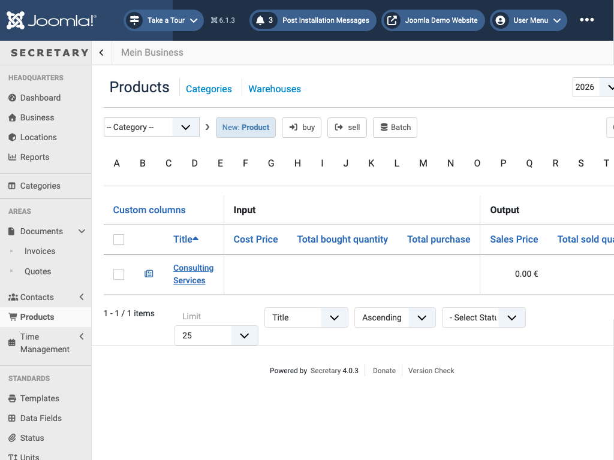

# Products

`view=products&catid=<category id>` - inventory/catalog items, split into **buy** and **sell** categories (purchasing vs. sales items, also managed under [Categories](categories.md)).

Toolbar: *New: Product*, *Batch*, and *buy* / *sell* - both create a new document pre-filled with the selected products as line items, tagged for that direction (purchasing vs. sales usage).

The *Warehouses* link (next to *Categories*) tracks stock across locations. Like Contacts, the list's columns are configurable via *Custom columns* - separate Input columns (Cost Price, Total bought quantity, ...) and Output columns (Sales Price, Total sold quantity, ...).

A product created directly as a line item while editing a [Document](documents.md#editing-a-document) shows up here automatically, ready to reuse.

← [Back to overview](index.md)
