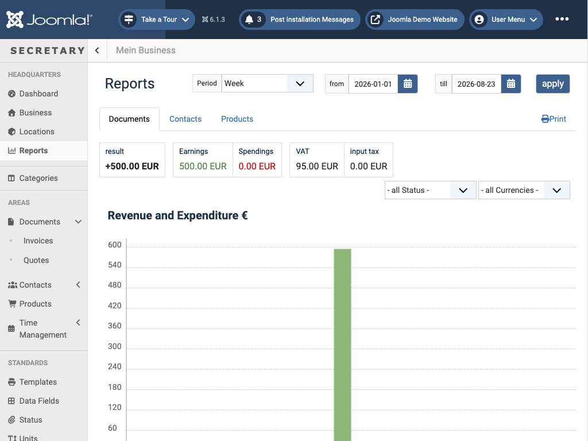

# Reports

`view=reports` - aggregate views across **Documents**, **Contacts**, and **Products**, selected via tabs.

Pick a **Period** (Week/Month/Year, or a custom *from*/*till* range) and click *apply*. The Documents tab (shown above) breaks the result down into result, earnings, spendings, VAT, and input tax tiles, plus a revenue-and-expenditure chart over the selected period; *all Status* / *all Currencies* filters narrow it further. The Contacts tab shows contact counts broken down by gender and category. The Products tab shows product counts and a bestseller chart (top N by sales, N configurable), filterable by status. *Print* renders the current report for printing.

← [Back to overview](index.md)
