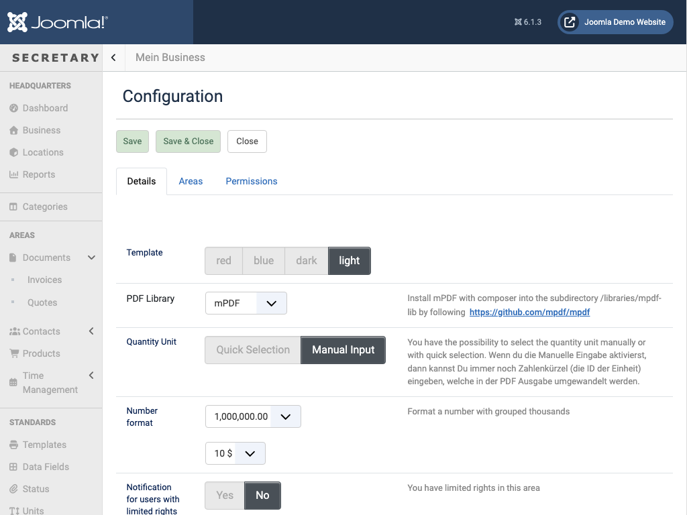
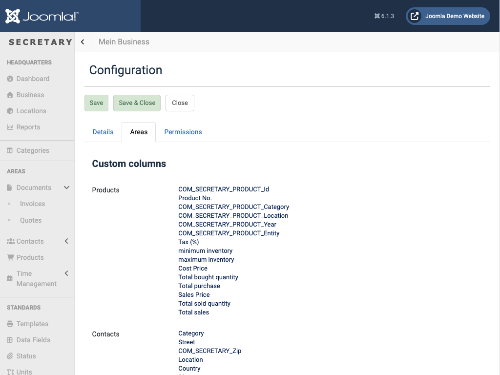
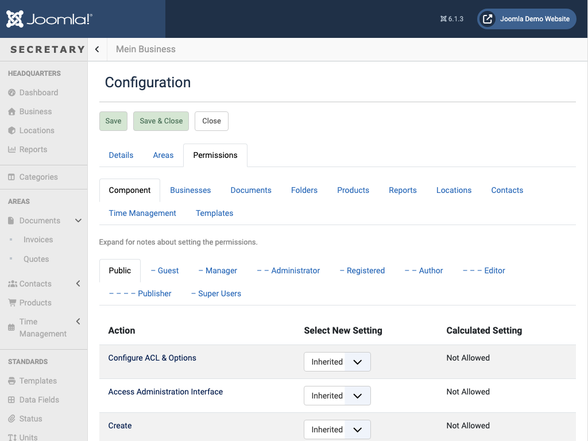

# Settings

`view=item&extension=settings&layout=edit` - component-wide configuration, organized into three tabs.

## Details

| Field | What it does |
|---|---|
| Template | The admin color theme (red/blue/dark/light) |
| PDF Library | Which PDF engine renders Preview/Email/PDF export - see [PDF generation](pdf.md) for installing one |
| Quantity Unit | Whether product/time quantity units are picked from a list (*Quick Selection*) or typed as a free-form code (*Manual Input*) |
| Number format | Decimal/thousands-separator style, and the currency symbol's position |
| Notification for users with limited rights | Whether restricted users get notified about activity in their area |
| Caching | Caches frequently-used routines (e.g. navigation) to save load time |
| Google Maps (API Key / Contacts / Locations) | A Google Maps Javascript API key, and whether to visualise Contact/Location addresses on a map with it (see [Contacts](contacts.md)) |
| Activity (creation/editing/deletion) | Which event types get logged to the [Dashboard](dashboard.md)'s Activity feed |
| Uploads (Allowed endings / Allowed file size) | File-type and size limits for document attachments |

## Areas

Configures the *Custom columns* pickers on the [Products](products.md) and [Contacts](contacts.md) list views (which columns are available to show/hide there), plus **Documents** settings: whether an individual document can be shared as a read-only link on the site frontend ("Documents preview in Frontend"), and whether the Documents list shows a date filter.

## Permissions

Joomla's standard Access Control List editor, scoped per section (Component, Businesses, Documents, Folders, Products, Reports, Locations, Contacts, Time Management, Templates) - each with its own Public/Guest/Manager/.../Super Users tabs. Same mechanism used for per-document permissions under [Documents → Permissions](documents.md#editing-a-document).

## Elsewhere in the sidebar

Also under the *Standards*/*System* groups (each backed by the generic `view=items&extension=<name>` list, same list/toolbar pattern as [Documents](documents.md)):
- **Data Fields** (`extension=fields`) - custom fields available on records, surfaced as the *Extended* tab when editing a Document
- **Status** (`extension=status`) - the set of statuses a document/contact can be in
- **Units** (`extension=entities`) - quantity units for products/time (e.g. hours, pieces, kg)
- **Currencies** (`extension=currencies`)
- **Translations** (`view=language`)
- **Files** (`extension=uploads`)
- **Database** (`view=database`) - maintenance tools for the component's own tables

← [Back to overview](index.md)
