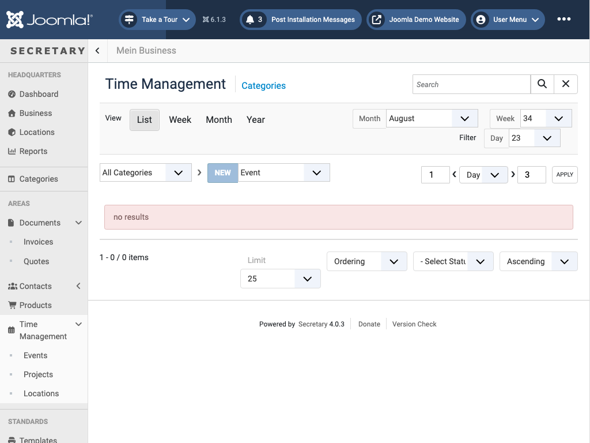

# Time Management

`view=times&extension=<events|projects|locations>` - scheduling and time tracking, split into three areas:
- **Events** - single dated appointments
- **Projects** - longer-running tracked work
- **Locations** - where time/events happen

The list view (`section=list`, shown above) supports switching to **Week**, **Month**, or **Year** calendar views for the same data via the *View* selector, alongside Month/Week/Day filter dropdowns. Each area (Events/Projects/Locations) has its own category dropdown and *New* button, matching the pattern used by [Documents](documents.md), [Contacts](contacts.md), and [Products](products.md).

← [Back to overview](index.md)
